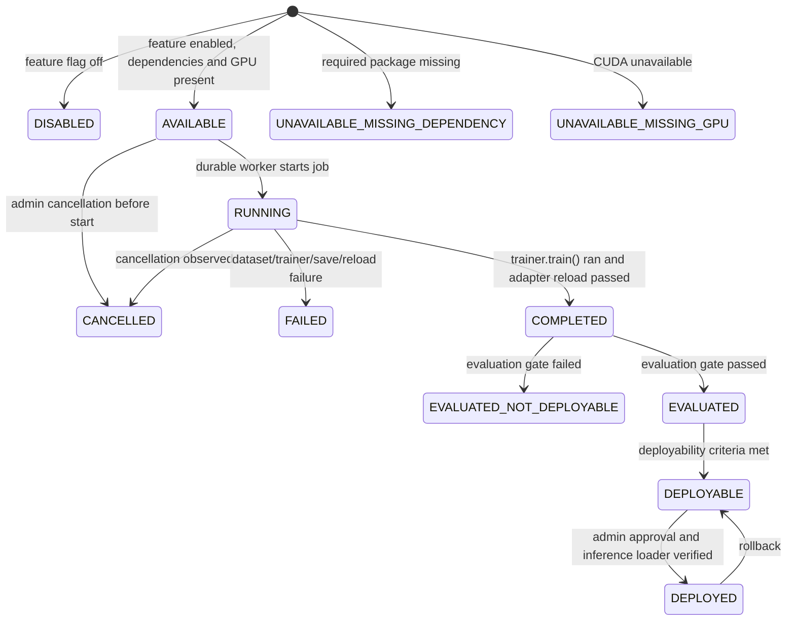

# Fine-Tuning Control Plane

This repository currently implements an honest disabled scaffold for fine-tuning. It no longer simulates loss curves, fake checkpoints, fake adapters, or fake deployment states in the real execution path.

## Current Result

The control plane can validate datasets, create durable job records, dispatch work to the existing Celery worker infrastructure, detect unavailable runtime conditions, execute a dependency-injected real training backend in tests, verify adapter reload before completion, run an evaluation gate, and block deployment unless inference integration is explicitly verified.

Local CPU-only environments should expect `UNAVAILABLE_MISSING_GPU` or `UNAVAILABLE_MISSING_DEPENDENCY` for real training attempts. This is intentional and must not be replaced with fake telemetry.

## State Machine

## Execution Boundaries

- Web API routes create and dispatch durable jobs; they do not run training in the FastAPI process.
- Durable job state is stored in `job_runs`.
- `JobRun.payload` stores non-secret configuration, base model, dataset ID, and adapter name.
- `JobRun.metadata` stores tenant/requesting-admin scope and structured lifecycle logs without dataset content.
- `JobRun.result` stores artifact path, evaluation metrics, deployability status, and environment metadata.
- Deployment is blocked unless an adapter has a verified artifact, passing evaluation status, explicit admin action, and a verified inference integration callback.

## Required Runtime for Real Training

Real training requires the configured feature flag, a CUDA-capable runtime, and the optional training dependencies used by `PeftTrainingBackend`: `torch`, `transformers`, `peft`, `trl`, and `datasets`.

Synthetic regression tests may use lightweight test doubles for the backend, but the application state machine, durable job records, dataset validation, worker dispatch, adapter reload gate, evaluation gate, tenant scoping, and deployment guard are exercised by real service code.
