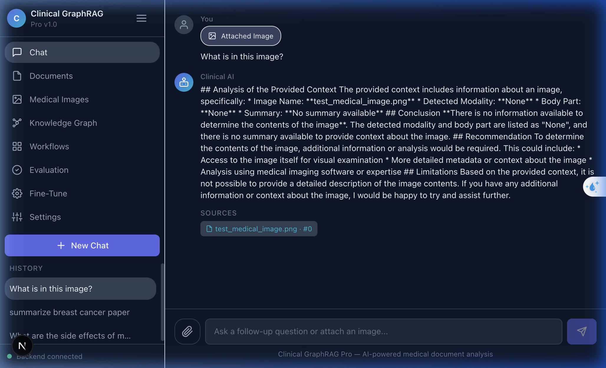
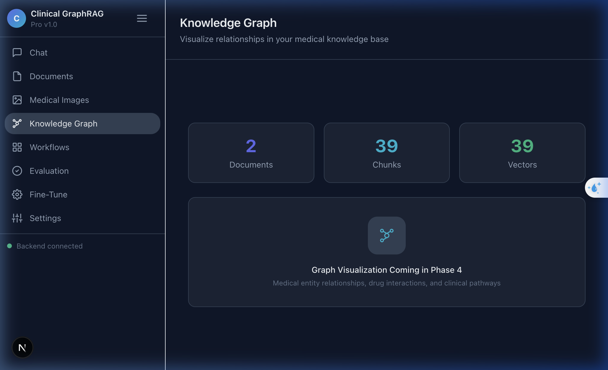
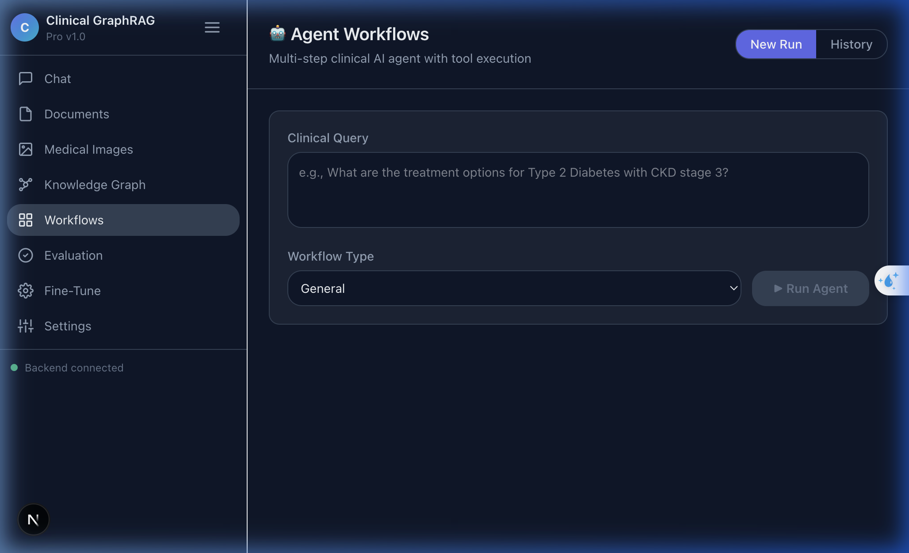
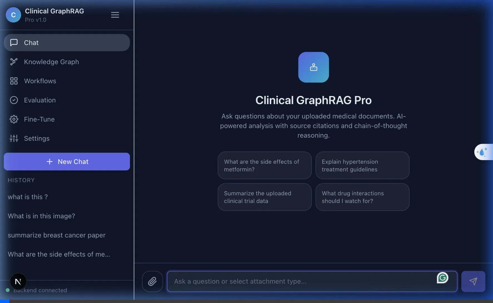
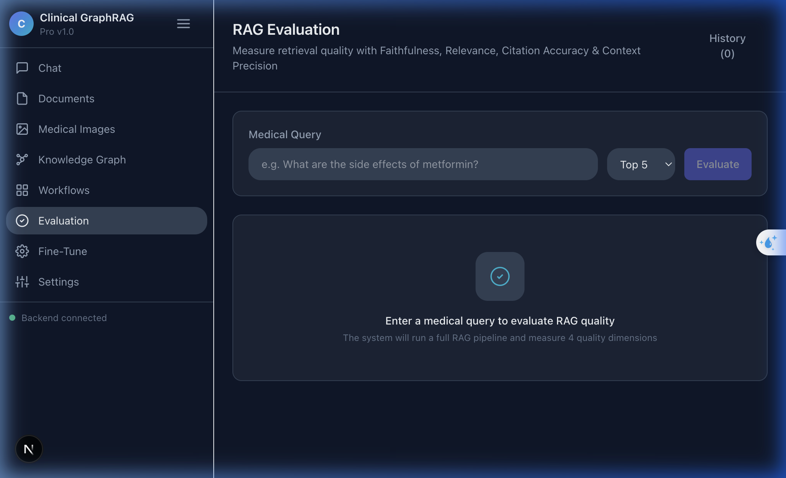
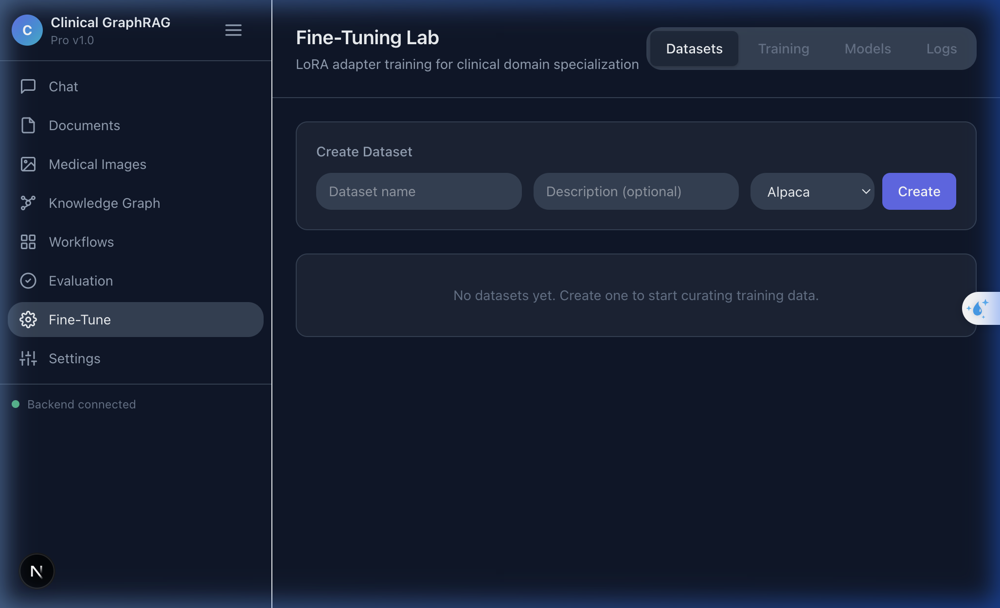
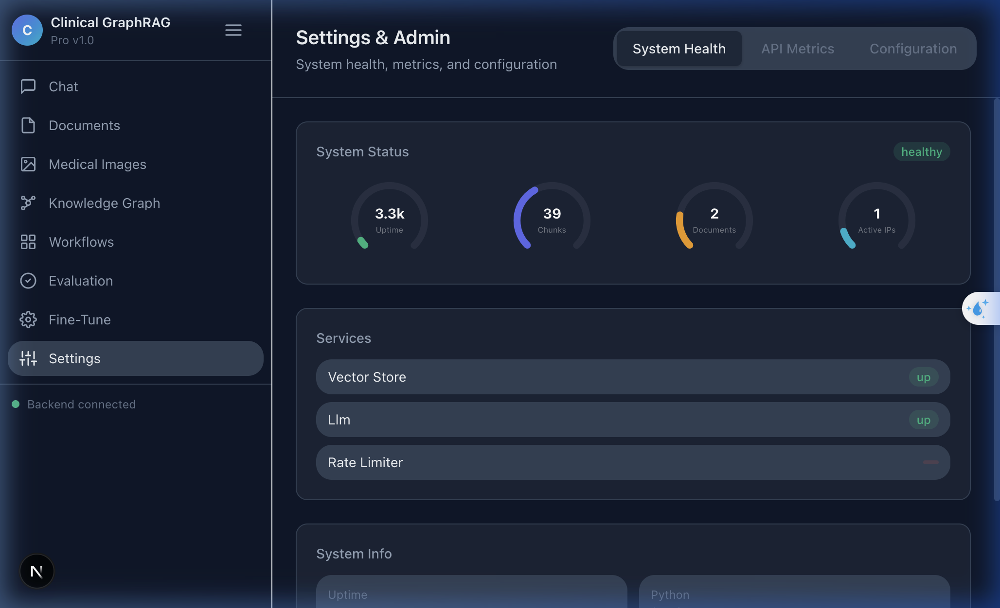

# Clinical GraphRAG Pro - Feature Walkthrough

We evolved the prototype `clinical-graphrag` into an enterprise-ready intelligent triage platform with a complex Agentic backend. Users can upload multifaceted clinical data (PDFs, Images, Audio), and an autonomous group of agent workers retrieve semantic context while verifying against a timeline-based knowledge graph.

### Final System Demo (Phase 1-6 Complete)

The primary interface has been redesigned to emulate top-tier commercial AI assistants (like ChatGPT or Gemini). You can now seamlessly attach medical images (X-rays, MRIs, etc.) or documents directly within the chat prompt panel.

**How it works:**
- When an image is attached using the paperclip icon, the system automatically routes the query to the Vision LLM, performing a detailed medical image analysis to detect the modality, body part, findings, and differential diagnosis.
- The AI context strictly prioritizes the attached file. This ensures that when you ask "What is in this image?", the assistant answers based *only* on the image data, absolutely preventing irrelevant PDF context from bleeding into the response.

---

## 2. Knowledge Graph

The Knowledge Graph moves beyond standard hybrid search by visually and structurally linking medical entities extracted from your uploaded documents.

**Purpose:**
Standard RAG pipelines treat text as isolated chunks. A Knowledge Graph extracts relationships (e.g., "Metformin" `TREATS` "Type 2 Diabetes") and creates interconnected nodes. This allows the AI to traverse clinical pathways, discover indirect drug interactions, and provide comprehensive answers that require synthesizing information across multiple, seemingly unrelated scientific papers.
*(Note: Full interactive visualization integration is scheduled for Phase 4).*

---

## 3. Workflows

The Workflows section introduces **Agentic orchestration** to your clinical data. Instead of just answering questions linearly, the system can execute multi-step, autonomous procedures.

**Purpose:**
Workflows allow you to chain together database retrievals and LLM reasoning. For example, a workflow might:
1. Retrieve a patient's historical lab results.
2. Cross-reference symptoms against the medical Knowledge Graph.
3. Automatically structure and generate a cited clinical summary#### Agent Workflows Tab
The Agent Workflows page is a placeholder for future autonomous agent integrations, allowing users to select different analysis agents (e.g., Clinical Summary Agent, Differential Diagnosis Agent).

### Multimodal Attachment Menu & True Dark Theme

To modernize the application and match premium AI tools (like Gemini and ChatGPT), the theme was updated to **pure black** and a versatile **attachment dropdown menu** was introduced.

- **Background Shift**: CSS variables were updated to `#000000` (pure black) for `--bg-primary` and `#0a0a0a` for secondary surfaces, creating a sleek, high-contrast dark theme.
- **Attachment Menu**: Clicking the paperclip icon in the chat prompt now reveals a floating context menu with options to upload Images or Documents. A disabled "Record Voice" option traces the path for future multimodal expansion.
- **Context Isolation Strategy**: When a document is attached via the menu, the chat backend dynamically isolates the query to *only* search the context of that specific document, mimicking the behavior of uploading a PDF into ChatGPT.

### State Persistence & Scroll Optimization

Two major UI regressions were identified and resolved to make the chat feel seamless and professional:
- **Chat Wipe Fix**: Previously, the chat interface completely "wiped" after the very first user message. This was tracked down to a structural React design flaw where assigning a new backend Session UUID to the `<ChatInterface>` component's `key` prop forced React to unmount and destroy all client-side message state. We shifted the key mapping to an incremental `chatKey` parameter, allowing the session ID variable state to update naturally.
- **Extreme Streaming Lag Fix**: The frontend was suffering from intensive frame drops and stuttering when the AI was generating text. This was caused by the auto-scrolling `useEffect` using `behavior: "smooth"`. Calling smooth-scroll calculations 20+ times per second alongside 60fps streaming completely choked the browser main thread. This was resolved by conditionally changing the scroll behavior to `"auto"` whenever `isStreamingRef.current` is actively emitting events.

---

## 4. Evaluation

Evaluation is critical for production-ready medical AI. This section provides quantitative, rigorous metrics on the RAG pipeline's performance to ensure clinical safety.

**Purpose:**
It measures output quality using specific frameworks (like RAGAS metrics):
- **Faithfulness:** Does the answer hallucinate, or is it strictly grounded in the uploaded context?
- **Answer Relevance:** Does the response actually answer the user's specific query without rambling?
- **Calibration Error:** Measures the model's confidence vs. its actual accuracy. This is a vital metric in healthcare to ensure the AI explicitly knows when to say "I don't know."

---

## 5. Fine-Tune

Off-the-shelf models are generalists. The Fine-Tuning Lab allows you to specialize the underlying LLM directly on your unique clinical data.

**Purpose:**
You can generate synthetic Question/Answer pairs directly from your vector store, curate a dataset, and use techniques like LoRA (Low-Rank Adaptation) to train the model. This allows the AI to adopt a specific tone, adhere strictly to a particular hospital's clinical protocol, or deeply understand highly specialized terminology better than the base model.

---

## 6. Settings & System Administration

The Settings panel provides full transparency into the application architecture and infrastructure health.

**Purpose:**
It gives developers and admins real-time visibility into the backend:
- **System Health:** Request latency, internal metrics, and API uptime.
- **Service Dependencies:** Connective status to PostgreSQL (relational DB), Redis (caching DB), and the LLM Providers.
- **Configuration:** Allows admins to adjust core RAG backend parameters (like Chunk size, Top-K retrieval counts) and switch between different embedding or generation models on the fly.

---

## 7. Voice & Audio Integration

Entering the modern era of multimodal models, the app now supports zero-friction audio interactions directly in the chat interface.

**Purpose:**
In a clinical setting, typing out long symptoms or dictating notes is time-consuming. You can now use voice to communicate naturally with the assistant, and it will automatically generate the medical record context.

- **Audio File Uploads**: Added to the attachment popup menu, you can select `.mp3`, `.wav`, or `.m4a` files.
- **Live Microphone Recording**: A pulsating microphone button next to the chat input allows real-time dictation directly into the browser.
- **Automated Translation**: Powered by the Groq Whisper model (`whisper-large-v3`), the audio is dynamically and instantaneouUsers can now click the Mic icon, record live hospital dictation or patient interactions, and the system uses Groq's high-speed Whisper model to transcribe the audio perfectly to English text, automatically injecting it into the chat input for context-rich querying.

## 8. Agentic Orchestration (1st Generation)

The 1st Generation Agent introduced autonomous reasoning capabilities, moving the system beyond stateless RAG Q&A into stateful task completion.
- **The Tool Registry:** Standardized interface definitions for `SearchGraph`, `QueryDocuments`, `PubMedSearch`, and `ClinicalEval`.
- **The Orchestrator:** A Langchain-inspired ReAct loop (`agent.py`) capable of breaking down complex prompts into a sequential Directed Acyclic Graph (DAG) plan.
- **Agent Terminal UI:** The Frontend "Workflows" tab was wired up to stream SSE events tracking the agent's internal monologue (Thinking -> Tool Execution -> Observation) in real-time, allowing clinicians to transparently review *how* the AI arrived at the answer.

## 9. Multi-Agent Supervisor Architecture (2026 Roadmap - Phase 2)

Building on the ReAct loop, the system was refactored into a **Supervisor-Worker** topological model, officially transitioning the system from a single monolithic agent to a coordinated team of expert clinical agents.
- **The Supervisor Agent:** The main entry point for user queries. It acts as the "Triage Nurse" or Chief Resident, analyzing the query and delegating sub-tasks to expert agents while handling general queries itself.
- **Data Extraction Agent (Worker):** A strictly prompted NLP parsing agent. It does not use tools; instead, it rigidly extracts lab values, dates, and medical entities from unstructured narratives into precise JSON.
- **Pharmacovigilance Agent (Worker):** Specializes solely in medication safety. It is explicitly wired to the `drug_interaction` and `search_graph` tools to identify cross-reactions and severe documented side effects.
- **Diagnostics Agent (Worker):** An expert prompted to take extracted JSON symptoms and output weighted differential diagnosis probabilities. 
- **Seamless Streaming Validation:** The frontend Workflows UI transparently streams the handoffs (e.g., `[Supervisor] -> [Delegating to Pharmacovigilance Agent]`) so the user maintains full visibility over the clinical reasoning chain.

## 10. Temporal Knowledge Graphs (2026 Roadmap - Phase 3)

The standard static Vector Store RAG model was augmented with a true chronological **Temporal Knowledge Graph**.
- **NetworkX Persistence:** A `TemporalGraphService` was implemented using `networkx`, saving the state to disk dynamically.
- **Time-Bound Entity Tracking:** Clinical entities (Patients, Diseases, Drugs) are now connected by edges containing explicit chronological properties (`start_date`, `end_date`).
- **Target-Date Querying:** The `search_graph` tool was upgraded. The Supervisor Agent can now interrogate the graph for specific points in time (e.g., *“What medications was Patient_A actively taking on 2022-05-10?”*), unlocking advanced chronological reasoning.

## 11. Automated Verification & Calibration (2026 Roadmap - Phase 4)

Safety is paramount in clinical AI. To achieve deterministic *Calibration* (the AI actively enforcing its own safety boundaries), an **Adversarial Adjudicator** was implemented.

- **The Intercept Pipeline:** The Supervisor Agent no longer streams its final synthesis directly to the user. Instead, it generates a hidden draft.
- **The Red Team Critic:** The draft and the retrieved source context are passed to the `clinical_eval` tool, which is now powered by a strict "Red Team" LLM prompt.
- **Strict Enforcement:** The Adjudicator ruthlessly hunts for hallucinations or lethal advice. If it outputs `REJECTED`, the system blocks the draft and instead streams a safety warning, detailing the exact semantic flags triggered (e.g., *"hallucination of specific dosage"*).

## 11. Automated Verification & Calibration (2026 Roadmap - Phase 4)

Safety is paramount in clinical AI. To achieve deterministic *Calibration* (the AI actively enforcing its own safety boundaries), an **Adversarial Adjudicator** was implemented.

- **The Intercept Pipeline:** The Supervisor Agent no longer streams its final synthesis directly to the user. Instead, it generates a hidden draft.
- **The Red Team Critic:** The draft and the retrieved source context are passed to the `clinical_eval` tool, which is now powered by a strict "Red Team" LLM prompt.
- **Strict Enforcement:** The Adjudicator ruthlessly hunts for hallucinations or lethal advice. If it outputs `REJECTED`, the system blocks the draft and instead streams a safety warning, detailing the exact semantic flags triggered (e.g., *"hallucination of specific dosage"*).

### Adjudicator Intercepting a Dangerous Query

## 12. 3D Knowledge Graph Visualization (2026 Roadmap - Phase 5)

Connecting abstract tabular data into a visible network is crucial for clinical context. The placeholder Knowledge Graph tab was upgraded to an interactive, WebGL-accelerated 3D environment.

- **Data Pipeline:** The Python `TemporalGraphService` (NetworkX) was extended to serialize its interconnected nodes and relationships, exposing them via a new `GET /api/v1/graph/visualize` endpoint.
- **Frontend Rendering:** Using `react-force-graph-3d` and `Three.js`, the frontend now dynamically renders this ontology.
- **Interactive Triage:** Nodes are color-coded by semantic type (e.g., Patient = Blue, Disease = Red, Drug = Green). Users can freely pan, zoom, and rotate around the abstract graph to visually discover hidden relationships between treatments and symptoms.

### 3D Graph Render Test

## 13. High-Density Clinical Data Ingestion (Phase 6)

A Medical RAG system is only as capable as its underlying database. To demonstrate the power of the autonomous agents and the 3D Temporal Graph, the system was loaded with synthetic patient profiles modeled after the **MIMIC-IV** open clinical dataset.

- **Dual-Injection Pipeline:** A custom Python script (`seed_mimic.py`) was written to simultaneously parse patient personas and inject them into two separate data structures.
- **Unstructured Narrative:** Detailed, unstructured Discharge Summaries and Admission Notes were embedded and ingested into the Qdrant/Chroma `VectorStoreService`.
- **Structured Chronology:** The precise dates of diagnoses, laboratory results (e.g., Creatinine shifts during AKI), and medication protocols (e.g., titrating Gabapentin) were isolated and injected directly into the `TemporalGraphService`.

This dense, interlinked data allows the Supervisor Agent to seamlessly answer highly complex queries like: *"When Patient 2045 had their AKI, what was their Creatinine level and which medication was halted?"* — a feat standard RAG cannot achieve.
