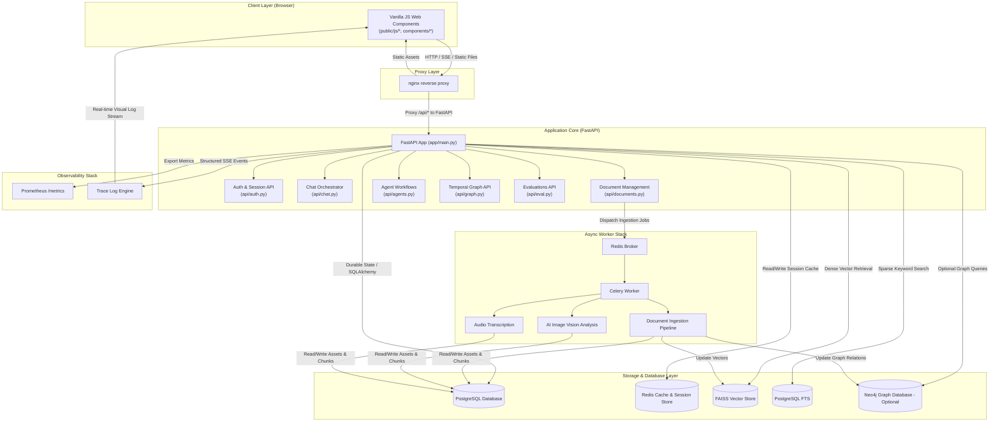
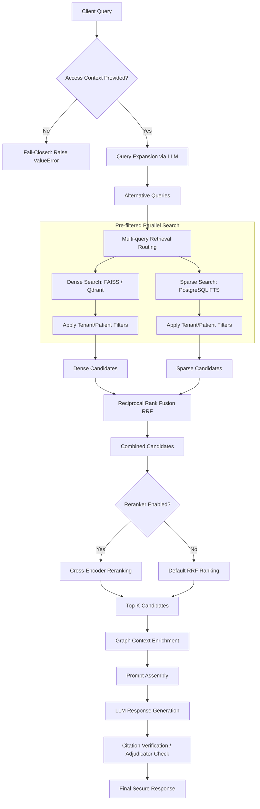
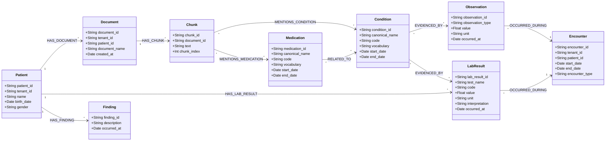
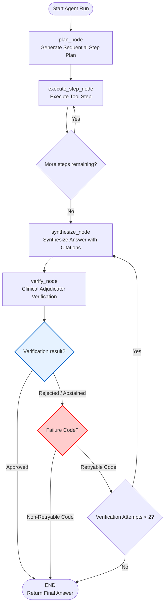
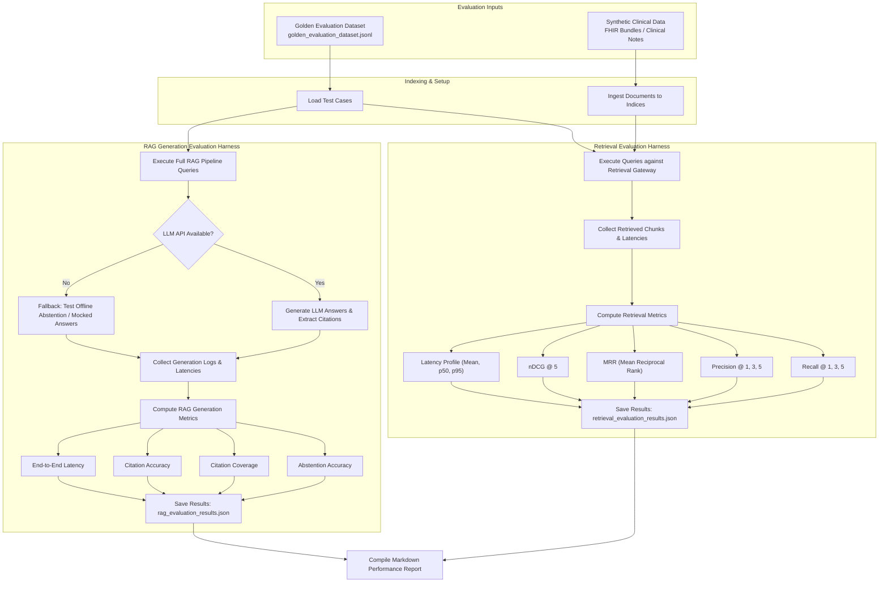

# Clinical GraphRAG Pro Compilation Report

Generated on: 2026-06-09 18:05:16

---

## 1. System Diagrams Overview

Below is the list of active Mermaid architecture diagrams defined in the repository under `docs/diagrams/`:

- **agent_workflow.mmd** (Path: `docs/diagrams/agent_workflow.mmd`)
- **clinical_graph.mmd** (Path: `docs/diagrams/clinical_graph.mmd`)
- **evaluation_pipeline.mmd** (Path: `docs/diagrams/evaluation_pipeline.mmd`)
- **rag_pipeline.mmd** (Path: `docs/diagrams/rag_pipeline.mmd`)
- **system_architecture.mmd** (Path: `docs/diagrams/system_architecture.mmd`)

---

## 2. Benchmark Summary

# Benchmark Results

## Overview
Clinical GraphRAG Pro was evaluated on 2026-04-02 using gemini-2.0-flash.
MedQA was not completed because the configured LLM credentials were not accepted by the provider.
Retrieval keyword hit rates were FAISS 100.0%, BM25 100.0%, and Hybrid 100.0%.

## MedQA Status
| Category | Direct Accuracy | RAG Accuracy |
| --- | ---: | ---: |
| N/A | N/A | N/A |

## RAG vs Direct LLM
| Category | Direct Accuracy | RAG Accuracy | Delta |
| --- | ---: | ---: | ---: |
| N/A | N/A | N/A | N/A |

## Retrieval Quality
| Method | Keyword Hit Rate | Top-5 Hit Rate | Mean Latency (ms) |
| --- | ---: | ---: | ---: |
| FAISS only | 100.0% | 100.0% | 17.094 |
| BM25 only | 100.0% | 100.0% | 0.311 |
| Hybrid + RRF | 100.0% | 100.0% | 14.733 |

## Methodology
- Dataset: 100 original clinical MCQ questions
- Split: Cardiology 20, Endocrinology 20, Nephrology 15, Pharmacology/Drug interactions 15, Pulmonology 15, Hematology 15
- Model: gemini-2.0-flash
- Temperature: 0 (deterministic)
- RAG: top-3 dense retrieval for MedQA prompt augmentation; top-5 hybrid retrieval with RRF fusion for retrieval-quality scoring

## Limitations
- Questions are synthetic, not from an official USMLE or MedQA release.
- Evaluation was conducted on 2026-04-02; results may vary with different indexed documents.
- The currently indexed retrieval corpus is whatever chunk artifacts were present locally at runtime.
- MedQA requires valid external LLM credentials; if provider auth fails, the benchmark reports that failure instead of fabricating accuracy.
- Retrieval hit-rate scoring is keyword based and does not replace physician review of answer quality.


---

## 3. System Architecture Details

# Clinical GraphRAG Pro Architecture

## System Overview

Clinical GraphRAG Pro is a browser-first clinical AI system built around a static frontend, a FastAPI backend, a hybrid retrieval stack, and a temporal graph layer. The deployment topology is coordinated via Docker Compose, where Nginx reverse-proxies requests, directing static content to the web client and `/api/` traffic to the FastAPI application. PostgreSQL is used for relational storage, Redis is utilized as a Celery message broker and cache provider, and Prometheus metrics are exposed at `/metrics`.

### High-Level System Architecture
The topology of the system components and their integration flow:



Retrieval, agent execution, graph persistence, and streaming each have their own service boundary.

---

## Component Deep Dives

### Retrieval Pipeline

The retrieval path is unified under a single entrypoint: **`QueryEngine.query()`** in [query_engine.py](../backend/app/services/query_engine.py), which is called by the chat flow ([rag.py](../backend/app/services/rag.py)), agent search tools ([tool_registry.py](../backend/app/services/tool_registry.py)), and graph endpoints.



1. **Access Isolation & Fail-Closed Validation.** The gateway enforces isolation boundaries based on `user_id`, `tenant_id`, `patient_id`, `organization_id`, and `owner`. If context-aware queries are initiated without any isolation fields, the gateway fails closed by raising a `ValueError`.
2. **Query expansion.** If `use_query_expansion` is enabled, `QueryEngine._expand_query()` asks the configured LLM for alternate medical phrasings. This helps with acronyms, synonyms, and wording variation common in clinical text.
3. **FAISS search.** Dense retrieval lives in `backend/app/services/vector_store.py`. The service embeds chunks with `sentence-transformers/all-mpnet-base-v2`, stores normalized vectors in `faiss.IndexFlatIP`. When filtering is active, it runs with adaptive overfetching (`initial_k = index.ntotal`) to prevent candidate starvation.
4. **Sparse search.** Sparse retrieval lives in `backend/app/services/bm25_index.py`. In local evaluation mode it uses `rank_bm25.BM25Okapi` when installed. In database runtime mode it searches persisted `DocumentChunk.search_vector` rows using PostgreSQL Full-Text Search with `ts_rank_cd`, filtered by tenant/user metadata JSONB queries; this PostgreSQL path is not BM25.
5. **RRF fusion.** If hybrid search is enabled, the query engine merges dense and sparse rankings with reciprocal rank fusion in `_rrf_merge()`. The scoring rule is `score(d) = sum(1 / (k + rank_i(d)))` with `k=60`, which avoids having to calibrate FAISS and sparse score scales.

Redis caching is implemented through `backend/app/core/caching.py`. When `CACHE_BACKEND=redis`, cache operations use async Redis, JSON serialization, TTLs, and tenant/patient-scoped keys. If Redis is unavailable, development and offline-demo mode fall back to local in-memory cache; production bypasses cache rather than using a per-process fallback. Cache metrics include hit, miss, set, delete, backend error, fallback, and latency counters/histograms.
6. **Cross-encoder reranking.** If reranking is enabled, `backend/app/services/reranker.py` rescores candidates with `cross-encoder/ms-marco-MiniLM-L-6-v2`. This is executed only on candidates that passed all authorization filters. Canonical portfolio benchmark artifact: `results/portfolio_gate_retrieval_benchmark_20260607T163206Z.json`. On synthetic benchmark v2, hybrid RRF improves over dense and sparse retrieval. Optional reranking improves Recall@5 from `0.8625` to `0.9042` but materially increases mean / p95 latency from `55.70 ms / 67.43 ms` to `244.36 ms / 287.63 ms`, so reranking remains disabled by default on latency-sensitive paths (`USE_RERANKING=false`). These results are synthetic regression results, not clinical validation.
7. **Context assembly.** `backend/app/services/rag.py` assigns citation IDs such as `SRC1`, truncates each chunk to `chat_context_max_chunk_words`, and stops when the full prompt reaches `chat_context_max_words`.
8. **Graph Context Enrichment.** If `patient_id` is supplied, `backend/app/services/rag.py` queries the clinical graph for patient-scoped, fact-level evidence. Each verified graph fact is appended as its own context item with a citation ID such as `GRAPH-COND-001` or `GRAPH-MED-001`; facts without source document and source chunk provenance are excluded from answer context.

---

### Temporal Knowledge Graph

The runtime graph is implemented in `backend/app/services/graph.py` and persisted through `GraphNode` and `GraphEdge` in `backend/app/models/persistence.py`.



To ensure reliability and clinical alignment, the system includes:
1. **Lightweight FHIR Ingestion Layer.** In `backend/app/services/fhir_ingestion.py`, we implement a FHIR parser supporting resources such as `Patient`, `Observation`, `Condition`, `MedicationRequest`, `DiagnosticReport`, `DocumentReference`, and `Encounter`. This layer maps FHIR resources to internal graph nodes and edges while preserving source IDs and references.
2. **Chunk-Level NLP Extraction & Provenance.** Entity extraction is run at the chunk level. Extracted entities are linked back to their respective document chunks via `MENTIONS_*` relationships, populating text offset spans (`source_text_span`), extraction confidence, and extraction method.
3. **Robust Temporal Tracking.** Date strings are parsed through `parse_date_robust`, and temporal status is classified relative to query target dates as `active`, `resolved`, `future`, or `unknown`. Invalid or missing start dates evaluate to `"unknown"` with low temporal certainty rather than defaulting to active.
4. **Tenant and Patient Isolation.** Visualization exports, graph exports, and temporal state queries are strictly scoped to the requesting patient and tenant, preventing any cross-tenant or cross-patient leakage.

---

### Agent System

The agent path is implemented as a LangGraph state machine in [agent.py](../backend/app/services/agent.py). The execution graph follows a plan -> execute -> synthesize -> verify loop and persists workflow rows, steps, and tool calls so the UI can replay what happened.



1. **Structured Schema Validation**: All major orchestrator states and models are enforced using Pydantic schemas defined in [workflow.py](../backend/app/schemas/workflow.py). The supervisor plan is validated against `AgentPlan`, and the red-team adjudicator evaluation is parsed via `VerificationResultSchema`.
2. **Context Scoping Gates**: All execution steps inject active `patient_id` and tenant scoping credentials (`user_id` or `tenant_id`) into the tool execution layer. Tools requiring patient or retrieval scopes (e.g. document search, graph search, image analysis) are checked programmatically in the registry before calling the handler, immediately raising a security error if scoping boundaries are breached.
3. **Adjudicator Critic & Fail-Closed Routing**: The internal critic tool `clinical_eval` performs programmatic checks for malicious prompt overrides and insufficient context, alongside standard LLM adjudication. On failure, it returns a structured code (`PROMPT_INJECTION_DETECTED`, `INSUFFICIENT_EVIDENCE`, `MISSING_CITATIONS`, `CROSS_TENANT_EVIDENCE`, `UNSAFE_TOOL_OUTPUT`, `CROSS_PATIENT_EVIDENCE`). If a non-retryable error code is matched, the orchestrator bypasses retry loops and halts execution immediately.
4. **Safe-buffered SSE Streaming**: During execution, the orchestrator streams structured trace events (`plan_created`, `tool_selected`, `tool_start`, `tool_complete`, `evidence_collected`, `answer_drafted`, `verification_passed`, `verification_failed`, `retry_triggered`, `abstention`, `workflow_complete`) as SSE data chunks. The system validates grounding/abstention before emitting answer chunks to the client. Provider-level streaming utilities may exist, but the chat path intentionally uses safe-buffered streaming to avoid sending unvalidated answer tokens.

---

### Evaluation Harness

The project includes a robust evaluation harness to benchmark retrieval accuracy and final RAG generation performance.



---

## Advanced Engineering Implementations

### Secure Multi-Tenant Caching

To optimize performance without introducing risk of cross-tenant or cross-patient leakage, the cache manager in [caching.py](../backend/app/core/caching.py) enforces key namespacing:
- **Cache Key Design**:
  ```text
  cgrag:{namespace}:{tenant_id}:{patient_id}:{input_payload_hash}
  ```
- **Bypass Safety Control**: If a scoped retrieval or reranking query executes without both `tenant_id` and `patient_id` context variables, the cache manager programmatically bypasses cache reads and writes, performing raw searches to ensure privacy bounds are maintained.
- **Engines Supported**: Configurable via `CACHE_BACKEND` (`in-memory` or `redis`).

### Local LLM Integration

The LLM abstraction layer in [llm.py](../backend/app/services/llm.py) supports running full reasoning workloads locally. This is useful for zero-cost developer testing, offline deployment, and local data privacy:
1. **Ollama**: Connects to `http://localhost:11434` running custom clinical models (e.g. `llama3`).
2. **llama.cpp**: Connects to a GGUF server listening at `http://localhost:8080`.
3. **Local Hugging Face (local_hf)**: Initiates a pipeline using `transformers` locally.
4. **Health Check Detection**: The `/api/health/detailed` endpoint verifies backing services by sending a test prompt payload to the active local model engine, reflecting readiness in the UI indicators.

### Cost Tracking and Telemetry

Prompt and response token usage are programmatically measured in [cost_estimator.py](../backend/app/services/cost_estimator.py):
- Each model transaction calculates cost projections in USD based on input and output pricing thresholds.
- Metrics are tracked in Prometheus and can be projected using the `backend/scripts/estimate_cost.py` utility modeling 100, 1k, and 10k query volumes.

---

## Technology Choices and Rationale

- **FastAPI async + SQLAlchemy async**: fits streaming, I/O-heavy APIs and keeps service boundaries explicit.
- **FAISS with optional Qdrant**: makes local development simple while leaving an external vector backend available.
- **BM25 alongside dense retrieval**: preserves exact-token recall for medications, abbreviations, and labs.
- **Database-backed temporal graph with optional Neo4j**: keeps the default stack self-contained without removing graph-native expansion paths.
- **Safe-buffered SSE over WebSocket for the main chat path**: matches one-way server-to-browser streaming and behaves cleanly behind nginx while preserving validation before answer chunks are emitted.
- **Vanilla JS Web Components**: removes the frontend build step (no Next.js/TypeScript runtime), at the cost of more manual state handling.

---

## Known Limitations and Disclaimer

> [!CAUTION]
> **THIS IS AN AI SYSTEMS ENGINEERING PORTFOLIO DEMONSTRATION.**
> It is **NOT** a clinically validated diagnostic system, nor does it guarantee compliance with HIPAA or HL7 standards:
> 1. It utilizes synthetic clinical notes and simplified FHIR schemas for demonstrating agent tool calling.
> 2. Entity normalization uses standard embeddings and regular expression dictionaries, lacking live terminological servers (like SNOMED CT or RxNorm API).
> 3. DO NOT deploy this software for inpatient triage, clinical diagnostic support, or real patient care.


---

## 4. Multi-Horizon Product Roadmap

# Clinical GraphRAG Pro Roadmap

This document outlines the multi-horizon development roadmap for Clinical GraphRAG Pro. It establishes priority, complexity, impact, dependencies, and acceptance criteria for features across three execution horizons.

---

## Horizon 1: Short-Term (1 - 2 Months)

### 1. Robust Agent Safety Routing & Guardrails
*   **Description**: Implement deterministic input/output guardrail checks (such as NeMo Guardrails or Llama Guard) to filter non-clinical queries or toxic/adversarial prompt injections before they reach the agent system.
*   **Priority**: High
*   **Impact**: High
*   **Complexity**: Medium
*   **Dependencies**: Backend configuration system, LLM service.
*   **Acceptance Criteria**:
    - Programmatic rejection of non-medical prompts with a custom status code.
    - Zero leakage of system instructions or retrieval prompts when tested with standard jailbreak datasets.

### 2. Local GPU Model Workloads & Quantization
*   **Description**: Extend the local LLM engine support to automatically run GGUF quantized models (e.g., Llama-3-8B-Instruct-Q4_K_M) on local GPU hardware via unified llama.cpp/Ollama integrations.
*   **Priority**: Medium
*   **Impact**: Medium
*   **Complexity**: Medium
*   **Dependencies**: Local llama.cpp/Ollama environment.
*   **Acceptance Criteria**:
    - Automated detection of Apple Silicon (Metal) or NVIDIA CUDA acceleration in `/api/health/detailed`.
    - Token generation speeds exceeding 15 tokens/sec for local 8B models.

---

## Horizon 2: Medium-Term (3 - 6 Months)

### 3. Interactive Cost Visibility & Telemetry Dashboards
*   **Description**: Expose token utilization, query costs, and cache hit rate telemetry in an interactive React/HTML dashboard on the frontend, retrieving data from Prometheus metrics.
*   **Priority**: High
*   **Impact**: High
*   **Complexity**: Medium
*   **Dependencies**: Prometheus API, frontend metrics collector.
*   **Acceptance Criteria**:
    - Visual rendering of query counts, total cost (in USD), and cache hit ratios.
    - Exportable metrics reports in CSV or JSON formats.

### 4. Advanced Evaluation Tooling & Synthetic Benchmarks
*   **Description**: Expand the evaluation harness with automated generation of synthetic patient cases and clinical Q&A pairs (leveraging clinical guidelines and mock EHRs) to evaluate new model iterations.
*   **Priority**: Medium
*   **Impact**: Medium
*   **Complexity**: High
*   **Dependencies**: Synthetic clinical data generators, evaluation runner service.
*   **Acceptance Criteria**:
    - Automated creation of 100+ multi-turn clinical test cases.
    - Execution of regression metrics (Recall, MRR, Citation coverage) with statistical variance reporting.

---

## Horizon 3: Long-Term (6 - 12+ Months)

### 5. FHIR-Compliant Bundle Export & Data Interoperability
*   **Description**: Implement full support for exporting clinical graphs and patient profiles into HL7 FHIR (JSON/XML) bundles conforming to standard US Core Profiles.
*   **Priority**: Medium
*   **Impact**: High
*   **Complexity**: High
*   **Dependencies**: PostgreSQL database schema, FHIR ingestion service.
*   **Acceptance Criteria**:
    - Successful validation of exported JSON bundles using the official HL7 FHIR validator tool.
    - Coverage of key resources: Patient, Encounter, Condition, MedicationRequest, Observation, DiagnosticReport.

### 6. Horizontal Retrieval Scaling & Distributed Vector Search
*   **Description**: Migrate from local FAISS/in-memory search to a distributed Qdrant or Milvus cluster, establishing horizontal scaling of clinical text chunks and indices.
*   **Priority**: Low
*   **Impact**: High
*   **Complexity**: High
*   **Dependencies**: Production hosting environment.
*   **Acceptance Criteria**:
    - Search latencies under 20ms across a corpus of 10,000,000+ clinical document chunks.
    - Zero data loss or query downtime during cluster node scaling.
